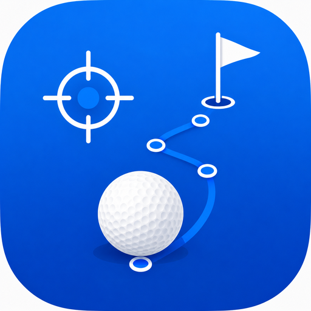

# Golf Shot GPS

A simple GPS shot tracker for golfers who want to measure their real shot distances on the course.

**[Open Golf Shot GPS](https://enginity-ch.github.io/golf-shot-gps/)**

## Intentionally Simple

Golf Shot GPS focuses on the essentials. No overloaded features — just quick and practical shot tracking while you play. Simplicity is an intentional product and design decision, keeping the app quick to understand and easy to use outdoors with one hand.

## Features

- GPS-based tee and shot-position tracking with shot-distance measurement
- Satellite map with live GPS position
- Simple TEE / SHOT workflow across multiple holes
- Track Position Mode and Free Map Mode
- North Up and Heading Up map orientation
- Automatic Free Mode when the map is moved, with one-tap return to tracking
- Saved rounds with read-only historical views
- Tee, shot, and distance labels
- Enlarged high-visibility tee markers
- Undo and active-round recovery after reload or reopening
- Native device backup export and merge import with duplicate protection
- Native app sharing where supported
- iPhone, iPad, Android, and Samsung support
- Add to Home Screen support

## How to Use

### 1. At the tee

Tap `START ROUND · TEE 1`, then hit your shot.

### 2. At your ball

Tap `SHOT 1`. The ball position and shot distance are recorded and displayed. Hit your next shot and repeat.

### 3. Next hole

Tap `NEXT HOLE` and record the next tee position.

### 4. Finish

Tap `FINISH` after your round. The round is saved automatically on the device.

## Add to Home Screen

Golf Shot GPS is a web app and does not need to be installed from an app store.

### iPhone / iPad

`Safari → Share → Add to Home Screen`

### Android

`Browser menu → Add to Home screen`

Golf Shot GPS can then be launched from the Home Screen like an app.

## Privacy

- No account or subscription is required.
- No personal data is collected in the current release.
- Saved rounds are stored locally in the user's browser or device.
- GPS positions used for rounds remain on the user's device.
- Golf Shot GPS currently does not transmit saved rounds or shot-position data to a server.

<!-- Developer reminder: review this section and the in-app Welcome privacy wording before releasing analytics or installation-ID tracking. -->

## GPS Accuracy

Measurements depend on the GPS accuracy of the user's device. Accuracy can vary with the device, satellite visibility, trees, buildings, surroundings, atmospheric conditions, and other factors. Golf Shot GPS displays available accuracy information where appropriate. Distances and positions are practical golf estimates, not survey-grade measurements.

## Compatibility

Golf Shot GPS is designed for modern browsers, including Safari on iPhone and iPad, Chrome on Android, Samsung Internet, and modern desktop Chrome, Edge, and Safari where applicable. Its primary use case is a GPS-capable smartphone on the golf course.

### Map provider configuration

The default base map is Esri. Developers can change the single `MAP_PROVIDER` constant in `index.html` to `esri`, `mapbox`, or `osm`. Esri uses authenticated ArcGIS Location Platform World Imagery plus the Static Basemap Tiles imagery-label overlay. Its dedicated public browser key is stored in `ESRI_API_KEY`, restricted to the canonical Enginity GitHub Pages URL, and has only the **Static basemap tiles** privilege. The key expires on 2027-08-13, usage is monitored in the ArcGIS account, and pay-as-you-go is disabled; the app contains no billing integration. Mapbox uses its Leaflet-compatible Static Tiles API path and requires a public, production-URL-restricted token in `MAPBOX_CONFIG`; it is not enabled for production. The OSM public tile service is a development/fallback option whose usage policy must be respected and may require replacement for significant public traffic. Mapbox's separate Mapbox GL JS map-load pricing model would require a future rendering-engine migration and is not used by this Leaflet implementation.

## Share Golf Shot GPS

If Golf Shot GPS is useful to you, please share the public entry link with your golfing friends: [enginity.ch/golf-shot-gps](https://enginity.ch/golf-shot-gps/).

## Support

Golf Shot GPS is free to use. Users who find it useful may [voluntarily support its continued development through Buy Me a Coffee](https://buymeacoffee.com/golf.shot.gps). Support is optional and does not unlock any functionality.

## License

Golf Shot GPS is not currently released as open-source software. Copyright © 2026 Enginity. All rights reserved. Public visibility of the source repository does not grant reuse rights. See [LICENSE](LICENSE). Third-party components remain subject to their own licenses and terms; see [THIRD_PARTY_LICENSES.md](THIRD_PARTY_LICENSES.md).
